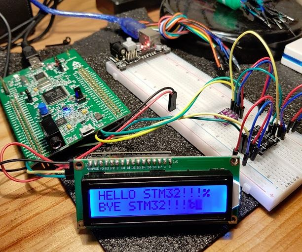

# STM32_HAL_I2C_HD44780
HD44780 I2C Library for STM32 
 
I've implemented a library based on Arduino Liquid Crystal I2C Library and STM32 HAL driver. 
I used PCF8574A expander IC and its address was 0x3F. 
If you use a different PCF8574x series, You may have to change I2C address. 
 
As I didn't test all of functions, You may experience some flaws while you're testing. 
 
Reference: https://github.com/johnrickman/LiquidCrystal_I2C 
 
 
